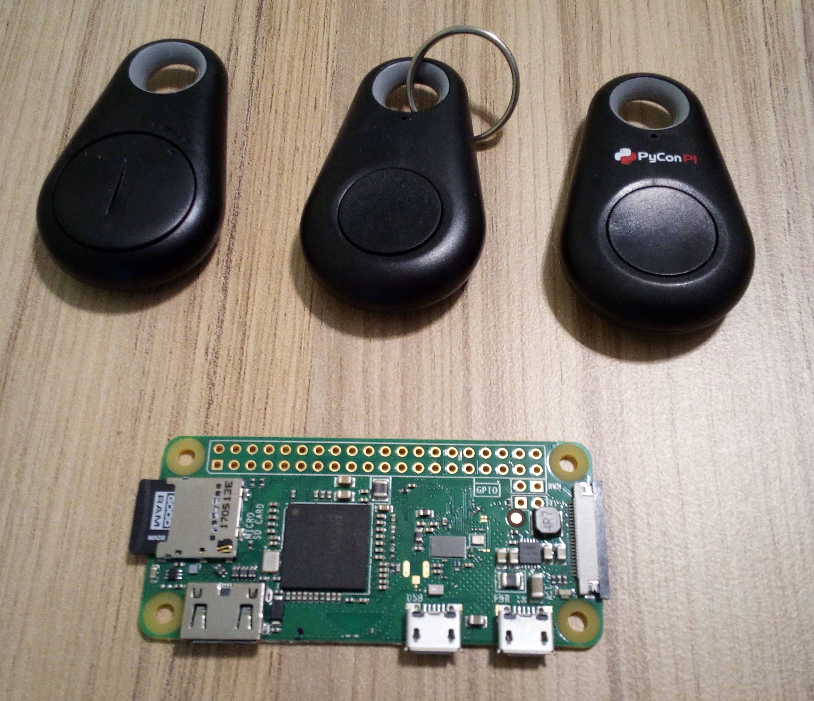

# Bluetooth LE to MQTT gateway
## iTAG scanner based on Python

Why would we have to do something, which is already present in Home Assistant (Bluetooth LE Tracker)?

* there are issues with performance, from Bluetooth LE Tracker documentation:

> We have received numerous reports that this integration will have a big impact on the performance of the server.
* my Raspberry Pi does not have a bluetooth connection
* my production Raspberry Pi would be installed in the attic - I have no idea, what would be the range of Bluetooth LE with this distance.

-------------------

What would we need?
* Raspberry Pi equipped with Bluetooth low energy. I guess the cheapest and smallest is Raspberry Pi Zero W, but any other would do the work.
* iTAG with Bluetooth LE. It's cheap and popular - they are sold commonly as "key localizator". One of them I have received on polish Pycon conference.



-------------------

Let's start with installing Raspbian on Raspberry Pi. Everything is poperly documented on www.raspberrypi.org, so I will skip this part. Of course version "Raspbian Stretch Lite' is perfect for us - we do not need GUI.
After installaion of Raspbian, we need to configure WiFi and SSH. As above, it's well documented here:
* https://www.raspberrypi.org/documentation/remote-access/ssh/README.md
* https://www.raspberrypi.org/documentation/configuration/wireless/headless.md

When we have everything setup, let's clone this repo, then install couple of necessary libraries to run gateway.py:
```
sudo apt-get install python-pip
sudo apt-get install libbluetooth-dev python-pip libglib2.0-dev
pip install -r requirements.txt
```

Bluepy needs special permissions to be run as not root, so check where bluepy-helper is installed:

```
python -m site --user-site
```
go to directory_from_above
```
sudo setcap 'cap_net_raw,cap_net_admin+eip' bluepy-helper
```

Finally install mosquitto and redis:

```
sudo apt-get install mosquitto-clients
pip install paho-mqtt

sudo apt-get install redis-server
pip install redis
```

-------------------

**Before start scanning rename config.sample.py to config.py, and set proper mqtt server credentials**

-------------------

Now we can start scanning
```
watch -n10 python gateway.py
```

This looks mqtt when iTAG will show up in range:
```
home/ble/id/0c:8c:dc:22:4b:69 home
```

And when it disappears:
```
home/ble/id/0c:8c:dc:22:4b:69 not_home
```

The only thing that we need, is to configure MQTT Device Tracker in Home Assitant in order to poperly interprete messages sent by MQTT.
